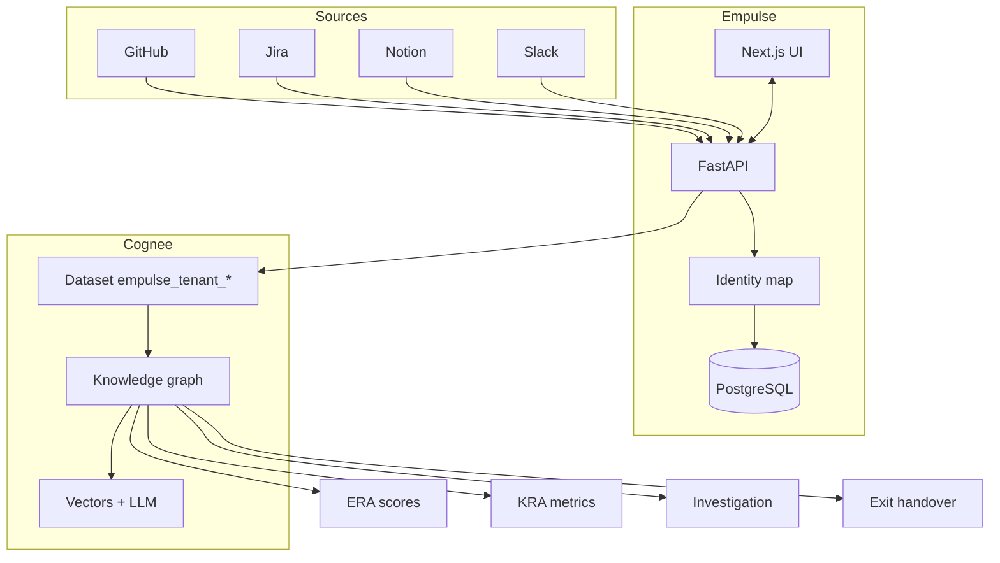

<div align="center">

# Empulse

**Engineering intelligence powered by [Cognee](https://www.cognee.ai/)**

Unify GitHub, Jira, Notion, and Slack into a tenant-scoped knowledge graph — then score people risk, architectural SPOFs, incident root cause, and exit handover with explainable evidence.

<br />

[](https://nextjs.org/)
[](https://fastapi.tiangolo.com/)
[](https://github.com/topoteretes/cognee)
[](https://www.postgresql.org/)
[](https://www.python.org/)
[](https://www.typescriptlang.org/)

[Quick Start](#quick-start) · [Features](#features) · [Architecture](#architecture) · [Configuration](#configuration) · [Deploy](#production) · [Docs](#documentation)

</div>

---

## Table of contents

- [About](#about)
- [Features](#features)
- [Architecture](#architecture)
- [Quick start](#quick-start)
- [Configuration](#configuration)
- [Production](#production)
- [Project structure](#project-structure)
- [Testing](#testing)
- [Documentation](#documentation)
- [Integrations](#integrations)
- [License](#license)

---

## About

Engineering orgs drown in tools but starve for **connected context**. PR history lives in GitHub, runbooks in Notion, incidents in Jira, decisions in Slack — and the org chart rarely matches reality.

Empulse answers one question before it becomes a crisis:

> If a key person or system fails tomorrow, what breaks — and can we prove why?

Built for the **[Cognee Hackathon](https://www.cognee.ai/)**, Empulse does not replace your stack. It **unifies** it: identity mapping, structured ontology ingest, graph-backed analytics, and LLM narratives where they add signal.

---

## Features

### Product modules

| Route | Module | What it does |
|-------|--------|--------------|
| `/dashboard` | Manager cockpit | Setup checklist, team health, and digest metrics |
| `/era` | **Employee Risk Assessment** | Command center + employee drill-down; five-dimension continuity risk with linked evidence |
| `/kra` | **Knowledge Risk Assessment** | Critical SPOFs, doc coverage gaps, file-risk matrix, blast-radius narratives |
| `/investigation` | Incident investigation | Multi-hop graph traversal during outage analysis |
| `/exit` | Employee knowledge handover | Handover pack pre-filled from graph context |
| `/settings/integrations` | Integrations | Connect GitHub, Jira, Notion, Slack; token verified on save; sync jobs with live progress |
| `/settings/org-chart` | **Organization Hub** | People (drag-and-drop org chart), components, and identity mapping in one workspace |
| `/settings/workspace-reset` | Workspace reset | Wipe tenant graph, vectors, and optional sync ledger (user menu) |
| `/onboarding` | Onboarding | Two-step wizard: integrations → org chart |

### Platform capabilities

- **Multi-tenant workspaces** with JWT auth, tenant switcher, and optional Google / GitHub OAuth
- **Organization Hub** — unified people org chart, component provisioning, and identity mapping (`?tab=identity`)
- **Identity mapping** — link `alice@co.com`, `gh-alice`, Slack IDs, and Jira users to one employee record; unmapped activity is quarantined, never guessed
- **Integration token verification** — GitHub, Jira, Slack, and Notion tokens validated on save via `/api/integrations/verify-token`
- **Integration sync jobs** — background ingest with live progress, history, and duration tracking
- **Component path attribution** — `docs/features/` folders provision org-chart components and map source paths for blame/PR ingest
- **Structured Cognee ontology** — `Person`, `Component`, `CodeArtifact`, `ChangeEvent`, `WorkItem`, `Document`, `Discussion` with typed relations (`owns`, `reportsTo`, `authored`, `documents`, `blocks`, `touches`, `resolves`, …)
- **ERA v2 scoring** — five-dimension engine behind `ERA_V2_SCORING`; command-center UI behind `NEXT_PUBLIC_ERA_COMMAND_CENTER`
- **GitHub depth** — PRs, reviews, branch commits, blame (multi-author), repo sync, code ownership (DOA); optional full file-body ingest
- **Cognee Cloud mode** — Kuzu staging graph → `cognee.push(preserve)` → hosted search & LLM (no Neo4j/Ollama on the host)
- **Workspace reset** — wipe tenant graph + vectors and optionally sync ledger / telemetry for a clean re-ingest
- **Integration-gated analytics** — ERA/KRA/investigation/exit show in-page blur until required connectors are connected
- **Production cold-start UX** — `/health/db` Postgres warmup + landing-page banner for free-tier hosts

---

## Architecture



| Layer | Technology |
|-------|------------|
| Frontend | Next.js 15, React 19, Tailwind CSS, Framer Motion, Recharts, React Flow |
| Backend | FastAPI, SQLAlchemy, Pydantic |
| Operational DB | PostgreSQL 16 |
| Knowledge graph | [Cognee](https://github.com/topoteretes/cognee) — Neo4j or Kuzu + LanceDB (local), or Cognee Cloud |
| LLM / embeddings | Ollama locally (`llama3.2`, `nomic-embed-text`); hosted LLM on Cognee Cloud |
| Auth | JWT cookies + optional Google / GitHub OAuth |

**Local dev:** Docker Postgres + Neo4j + Ollama.  
**Production (Railway / Render):** Postgres + embedded Kuzu staging + Cognee Cloud.

---

## Quick start

### Prerequisites

- [Docker](https://docs.docker.com/get-docker/)
- Python 3.11+
- Node.js 20+
- [Ollama](https://ollama.com/) with `llama3.2` and `nomic-embed-text` (local Cognee mode)

### 1. Clone & configure

```bash
git clone https://github.com/Aravind-Kannan/empulse.git
cd empulse

cp backend/.env.example backend/.env
cp frontend/.env.example frontend/.env.local   # optional — defaults work for localhost
```

### 2. Start databases

```bash
docker compose up -d postgres
# Optional — Neo4j browser at http://localhost:7474
docker compose up -d neo4j
```

### 3. Backend

```bash
cd backend
python -m venv .venv && source .venv/bin/activate
pip install -r requirements.txt
uvicorn app.main:app --reload --port 8000
```

Open API docs at [http://localhost:8000/docs](http://localhost:8000/docs).

### 4. Frontend

```bash
cd frontend
npm install
npm run dev
```

Open the app at [http://localhost:3000](http://localhost:3000).

### 5. Ollama models

```bash
ollama pull llama3.2
ollama pull nomic-embed-text
```

### Demo walkthrough

1. **Sign up** → onboarding step 1: connect integrations (tokens verified on save)
2. **Onboarding step 2** → org chart: drag-and-drop people, import members from connected sources
3. **Sync** → run integration sync from Integrations or dashboard; watch job progress in the UI
4. **Organization Hub** → `/settings/org-chart` — refine people, components, and identity mappings
5. **ERA** → `/era` — command center and per-employee risk with evidence; configure alerts in-page
6. **KRA** → `/kra` — SPOFs, documentation coverage panel, file-risk matrix
7. **Investigation** → `/investigation` — graph-backed incident analysis
8. **Exit** → `/exit` — handover pack from graph context

---

## Configuration

### Environment variables

<details>
<summary><strong>Backend</strong> — <code>backend/.env</code></summary>

| Variable | Default | Purpose |
|----------|---------|---------|
| `DATABASE_URL` | local Postgres | Operational database |
| `APP_ENV` | `development` | `production` enables health-check semantics |
| `COGNEE_BACKEND` | `local` | `cloud` for Cognee Cloud ingest + LLM |
| `COGNEE_SERVICE_URL` | — | Cloud tenant URL |
| `COGNEE_API_KEY` | — | Cloud API key |
| `COGNEE_GRAPH_DB_PROVIDER` | `neo4j` | `kuzu` for embedded graph (production) |
| `GITHUB_INGEST_FILE_CONTENT` | off | Store full file bodies on `CodeArtifact` nodes |
| `ERA_V2_SCORING` | `true` | Five-dimension ERA scoring engine |
| `COGNIFY_ENRICHMENT_ENABLED` | auto | LLM narrative pass after structured cognify (skipped for Ollama unless set) |
| `INTERNAL_DEBUG_KEY` | blank | Optional guard for `/api/internal/*` debug routes |
| `JWT_SECRET` | change me | Auth signing key |
| `FRONTEND_URL` / `BACKEND_URL` | localhost | CORS + OAuth redirects |
| `GOOGLE_CLIENT_*` / `GITHUB_CLIENT_*` | blank | Optional social login |

See [`backend/.env.example`](backend/.env.example) for the full list.

</details>

<details>
<summary><strong>Frontend</strong> — <code>frontend/.env.local</code></summary>

| Variable | Default | Purpose |
|----------|---------|---------|
| `NEXT_PUBLIC_API_URL` | `http://localhost:8000` | Backend API base URL |
| `NEXT_PUBLIC_FRONTEND_URL` | `http://localhost:3000` | Public app URL |
| `NEXT_PUBLIC_APP_ENV` | `development` | `production` → Postgres warmup banner on landing |
| `NEXT_PUBLIC_ERA_COMMAND_CENTER` | `true` | Set `false` for classic ERA dashboard layout |

See [`frontend/.env.example`](frontend/.env.example).

</details>

### How Empulse uses Cognee

| Cognee capability | Empulse usage |
|-------------------|---------------|
| `add_data_points` | Typed ontology ingest from integration sync |
| Graph relations | `owns`, `reportsTo`, `authored`, `documents`, `blocks`, `touches`, `resolves`, … |
| `cognify` / `remember` | Narrative enrichment on unstructured text |
| `GRAPH_COMPLETION` | KRA blast-radius stories, investigation follow-ups |
| Per-tenant datasets | `empulse_tenant_<uuid>` isolation |
| Cloud push | Local Kuzu staging → `cognee.push(preserve)` → cloud vectors via `remember()` |

---

## Production

Template production vars: [`backend/.env.example`](backend/.env.example) and `backend/.env.production.local` (not committed).

```bash
# backend/.env (production highlights)
APP_ENV=production
COGNEE_BACKEND=cloud
COGNEE_GRAPH_DB_PROVIDER=kuzu
COGNEE_SERVICE_URL=https://your-tenant.aws.cognee.ai
COGNEE_API_KEY=your-api-key
DATABASE_URL=postgresql+psycopg2://...
JWT_SECRET=<openssl rand -hex 32>
FRONTEND_URL=https://your-app.example.com
BACKEND_URL=https://your-api.example.com
AUTH_COOKIE_SECURE=true
```

```bash
# frontend/.env.local (production)
NEXT_PUBLIC_APP_ENV=production
NEXT_PUBLIC_API_URL=https://your-api.example.com
NEXT_PUBLIC_FRONTEND_URL=https://your-app.example.com
```

Cloud sync path: structured ingest → local Kuzu graph → `cognee.push(preserve)` → cloud vectors via `remember()`.

### Render (512MB free tier)

| Setting | Value |
|---------|--------|
| **Root Directory** | `backend` |
| **Build Command** | `pip install -r requirements-prod.txt` |
| **Start Command** | `uvicorn app.main:app --host 0.0.0.0 --port $PORT` |

Cloud mode skips heavy graph/vector migrations and `remember()` provisioning at startup (runs on first sync instead). Use `requirements-prod.txt` — no Ollama/Neo4j cognee extras. If still tight on memory, bump Render plan or add a persistent disk for `.cognee_system`.

---

## Project structure

```
empulse/
├── frontend/                 Next.js App Router UI
│   └── src/
│       ├── app/              Routes (/era, /kra, /onboarding, /settings/…)
│       ├── components/       Feature UI by module (era, kra, org-workspace, …)
│       └── lib/              API client, types, env helpers
├── backend/
│   └── app/
│       ├── routes/           FastAPI routers
│       ├── services/         Business logic, Cognee ingest, sync jobs
│       ├── ontology/         Typed DataPoints for structured graph ingest
│       └── models/           SQLAlchemy tables
├── docs/features/            Feature READMEs + GitHub path→component attribution
├── design-docs/              ERA specification and implementation notes
├── notion-docs/design/       Product design summaries per module
├── docker-compose.yml        PostgreSQL + optional Neo4j
└── cursor.md                 Developer / agent project guide
```

---

## Testing

```bash
cd backend
source .venv/bin/activate
pytest -q
```

74+ backend test modules cover ERA scoring, integration sync, ontology ingest, Cognee cloud mode, GitHub commits/blame, identity mapping, and incident investigation.

---

## Documentation

| Path | Contents |
|------|----------|
| [docs/features/](docs/features/README.md) | Feature map, component provisioning, path attribution |
| [notion-docs/design/](notion-docs/design/00-platform-overview.md) | Product design summaries per module |
| [design-docs/era/](design-docs/era/README.md) | Full ERA specification |
| [cursor.md](cursor.md) | Developer / agent project guide |
| [docs/features/integration-sync/](docs/features/integration-sync/README.md) | Connector sync behavior |
| [backend/docs/](backend/docs/) | Neo4j tenant queries, investigation notes |

---

## Integrations

| Source | Pulled into the graph |
|--------|----------------------|
| **GitHub** | PRs, reviews, branch commits, file blame, repo sync, code ownership |
| **Jira** | Tickets, assignees, blockers |
| **Notion** | Pages, documentation edges to components |
| **Slack** | Thread discussions linked to incidents and work |

All connectors share a unified **identity mapping** layer (Organization Hub → Identity tab) so external identities resolve to real employees in your org chart. Tokens are verified on save before credentials are stored.

---

## License

Hackathon submission — see repository for license terms if applicable.

---

<div align="center">

Built with **[Cognee](https://www.cognee.ai/)** — turning engineering chaos into a graph you can reason about.

</div>
