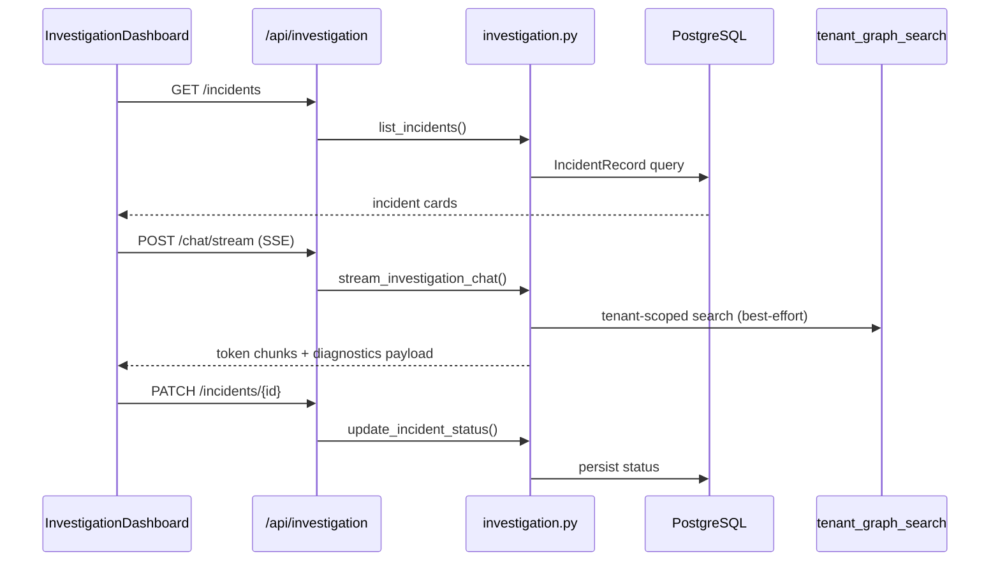

# Incident Investigation (II)

Engineering managers use the **Incident Investigation** workspace to triage active outages, correlate signals across the knowledge graph, and isolate probable root causes. The module is exposed at `/investigation` and abbreviated **II** in the product UI.

---

## Product overview

### Purpose

When high-priority alerts land, II provides a mission-control layout to:

- Browse and filter **past and active incidents** by lifecycle status
- **Chat** with an assistant that simulates Cognee graph traversal
- Review **diagnostics**: probable root cause, confidence score, and emergency workaround
- See **recommended SMEs** and searchable **references** (Slack, Notion, postmortems)
- **Update incident status** as the investigation progresses

### Workspace layout

```
┌─────────────────────────────────────────────────────────────────────────┐
│  Incident history bar — status tabs + horizontal incident cards         │
├──────────────────┬──────────────────────┬───────────────────────────────┤
│  Left: Chat      │  Center: Diagnostics │  Right: Context & experts     │
│  SSE streaming   │  Confidence gauge    │  SME list + compatibility %   │
│  Suggestion chips│  Root cause          │  Reference search             │
│                  │  Workaround          │                               │
│                  │  Graph hops          │                               │
│                  │  Status dropdown     │                               │
└──────────────────┴──────────────────────┴───────────────────────────────┘
```

### Incident lifecycle

| Status | Meaning |
|--------|---------|
| **Open** | New or unassigned incident |
| **Investigating** | Active root-cause work in progress |
| **Waiting for Input** | Blocked on external information |
| **Resolved** | Mitigation applied; monitoring |
| **Closed** | Fully closed |

### Access & prerequisites

- **Route:** `/investigation` (sidebar: “Incident Investigation”)
- **Integration gate:** Jira must be connected and validated (`WORKSPACE_INTEGRATION_REQUIREMENTS` in `frontend/src/lib/integrations.ts`)
- **Onboarding checklist:** Dashboard setup checklist calls out Jira for “incident and sprint data”

### Demo seed data

On first tenant bootstrap, five demo incidents are inserted (Payment Gateway, Auth Service, Notification Hub) spanning all status values. These power the history bar out of the box.

### Dashboard coupling

- **Open incident count** on the manager dashboard is derived from non-Resolved / non-Closed incidents (`backend/app/services/dashboard.py`).
- Resolving or closing an incident in II calls `notifyIncidentResolved()` in `WorkspaceContext`, which decrements the dashboard metric optimistically.

---

## Code architecture

### High-level flow



### Backend

| Layer | Path | Role |
|-------|------|------|
| Router | `backend/app/routes/investigation.py` | HTTP endpoints, tenant auth |
| Service | `backend/app/services/investigation.py` | Business logic, streaming, diagnostics |
| Schemas | `backend/app/schemas/investigation.py` | Pydantic models |
| Model | `backend/app/models/operational.py` → `IncidentRecord` | Tenant-scoped incident persistence |
| Bootstrap | `backend/app/services/tenant_bootstrap.py` | Seeds `_DEMO_INCIDENTS` per tenant |
| Registration | `backend/app/main.py` | Includes `investigation_router` |

#### API endpoints

| Method | Path | Description |
|--------|------|-------------|
| `GET` | `/api/investigation/statuses` | List valid status strings |
| `GET` | `/api/investigation/incidents` | List incidents; optional `?status=` filter |
| `PATCH` | `/api/investigation/incidents/{id}` | Update incident status |
| `POST` | `/api/investigation/chat/stream` | SSE chat; returns tokens then diagnostics |

All incident routes require an authenticated **tenant** (`CurrentTenant`).

#### Chat & diagnostics logic

`stream_investigation_chat()`:

1. Parses **system scope** from the user message (keyword match against Payment Gateway, Auth Service, Notification Hub)
2. Extracts optional **Jira ticket ID** via regex (`PROJ-992` pattern)
3. Attempts **`tenant_graph_search()`** against the tenant Cognee dataset (errors are swallowed; search is best-effort today)
4. Streams intro + narrative tokens over **Server-Sent Events** (`type: token`)
5. Emits a final **`type: diagnostics`** chunk built by `build_diagnostics()`

Diagnostics are currently **template-driven** per system scope (`_SYSTEM_DIAGNOSTICS` in `investigation.py`), including:

- Probable root cause narrative
- Confidence score (68–94% depending on system)
- Emergency workaround text
- Graph hop trail (ownership / reporting edges; Jira link appended when parsed)
- SME recommendations (employee ID, name, role, compatibility %, presence)
- References (Slack threads, Notion pages, postmortems)

#### Data model: `IncidentRecord`

```text
incident_records
  id            PK (string, e.g. inc-001)
  tenant_id     FK → tenants
  title
  status
  system_scope
  jira_id       optional
  updated_at
```

---

### Frontend

| File | Role |
|------|------|
| `frontend/src/app/investigation/page.tsx` | App Router page shell |
| `frontend/src/components/investigation/InvestigationDashboard.tsx` | Orchestrator: loads incidents, wires panels, status updates |
| `frontend/src/components/investigation/IncidentHistoryBar.tsx` | Status filter tabs + selectable incident cards |
| `frontend/src/components/investigation/InvestigationChatPanel.tsx` | Chat UI, suggestion chips, SSE consumer |
| `frontend/src/components/investigation/InvestigationDiagnosticsPanel.tsx` | Confidence gauge, root cause, workaround, hops, status select |
| `frontend/src/components/investigation/InvestigationContextPanel.tsx` | SME list + searchable references |
| `frontend/src/lib/api.ts` | `fetchIncidents`, `updateIncidentStatus`, `streamInvestigationChat` |
| `frontend/src/lib/types.ts` | `IncidentSummary`, `InvestigationDiagnostics`, related types |
| `frontend/src/context/WorkspaceContext.tsx` | `refreshMetrics`, `notifyIncidentResolved` |

#### Client streaming

`streamInvestigationChat()` reads the SSE body, parses `data: {json}` lines, and dispatches:

- `token` → append to assistant message
- `diagnostics` → lift state to center + right panels
- `done` → end stream

Pre-baked **chip suggestions** in the chat panel mirror the three seeded system scopes (payment, auth, notifications).

---

## What is real vs. simulated today

| Capability | Status |
|------------|--------|
| Incident list & status persistence | **Real** — PostgreSQL `incident_records` |
| Tenant-scoped incident queries | **Real** |
| Status updates reflected in dashboard counts | **Real** |
| Cognee graph search during chat | **Attempted** — `tenant_graph_search`; result not yet wired into diagnostics |
| Root cause, confidence, SMEs, references | **Simulated** — static templates keyed by system scope |
| SSE streaming narrative | **Simulated** — tokenized mock text with artificial delay |
| Live Jira / Slack / Notion ingestion in II | **Not wired** — references are demo URLs/snippets |

Jira integration elsewhere in the product (connect, member import, Cognee sync) feeds the broader knowledge graph that II is designed to query; the investigation chat does not yet consume live Jira issue payloads directly.

---

## Related references

- Original build prompt: `prompts/06_incident_investigation_workspace.md`
- Product module index: `cursor.md` (route `/investigation`)
- Jira workspace gate: `frontend/src/lib/integrations.ts` → `WORKSPACE_INTEGRATION_REQUIREMENTS`
