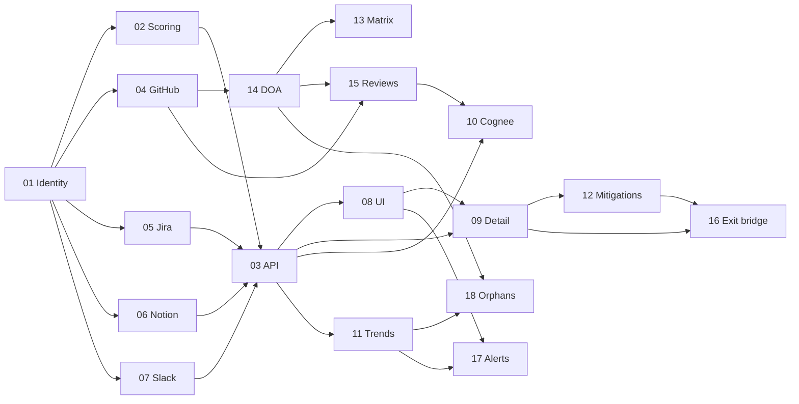

# ERA Implementation Plans

Step-by-step implementation guides for [Employee Risk Assessment](./employee-risk-assessment.md).

## Documents

| Step | File | Estimate | Summary |
|------|------|----------|---------|
| — | [design-improvements.md](./design-improvements.md) | — | v1→v2 changes + incorporated reference features |
| — | [design-deferred.md](./design-deferred.md) | — | Post–v1 follow-ups (not in current plan) |
| — | [IMPLEMENTATION-PROMPTS.md](./IMPLEMENTATION-PROMPTS.md) | — | Copy-paste agent prompts + per-step verification |
| 01 | [step-01-identity-foundation.md](./step-01-identity-foundation.md) | 3–5 d | Identity gate, confidence, quarantine queue |
| 02 | [step-02-scoring-engine.md](./step-02-scoring-engine.md) | 4–6 d | K/O/D/S/B dimensions, role weights, normalization |
| 03 | [step-03-evidence-api-contract.md](./step-03-evidence-api-contract.md) | 2–3 d | API v2 schema, team summary, evidence rules |
| 04 | [step-04-github-telemetry.md](./step-04-github-telemetry.md) | 5–7 d | Live GitHub sync, CODEOWNERS, PR/commits |
| 05 | [step-05-jira-telemetry.md](./step-05-jira-telemetry.md) | 4–6 d | Issues, epics, sprint load, backlog boost |
| 06 | [step-06-notion-telemetry.md](./step-06-notion-telemetry.md) | 5–7 d | Directory, runbooks, staleness, living runbooks |
| 07 | [step-07-slack-telemetry.md](./step-07-slack-telemetry.md) | 5–7 d | Incidents, on-call, escalation routing |
| 08 | [step-08-ui-command-center.md](./step-08-ui-command-center.md) | 6–8 d | Primary UI — command center |
| 09 | [step-09-ui-employee-detail.md](./step-09-ui-employee-detail.md) | 4–5 d | Drill-down drawer, evidence, graphs |
| 10 | [step-10-cognee-intelligence.md](./step-10-cognee-intelligence.md) | 5–7 d | Backup candidates, doc edges, blast radius |
| 11 | [step-11-trends-and-rollups.md](./step-11-trends-and-rollups.md) | 4–5 d | Snapshots, sparklines, manager roll-up |
| 12 | [step-12-mitigations-actions.md](./step-12-mitigations-actions.md) | 3–4 d | Recommendations, action tracking |
| 13 | [step-13-file-risk-matrix-hotspots.md](./step-13-file-risk-matrix-hotspots.md) | 4–5 d | CodePulse-style churn × ownership matrix |
| 14 | [step-14-doa-ownership.md](./step-14-doa-ownership.md) | 5–8 d | ContributorIQ DOA + knowledge decay |
| 15 | [step-15-review-network-risky-changes.md](./step-15-review-network-risky-changes.md) | 4–6 d | Review graph + risky PR detection |
| 16 | [step-16-era-exit-bridge.md](./step-16-era-exit-bridge.md) | 3–5 d | WorkFera-style ERA → Exit handover pre-fill |
| 17 | [step-17-alerts-review-cadence.md](./step-17-alerts-review-cadence.md) | 3–5 d | Proactive alerts + monthly risk review |
| 18 | [step-18-orphan-files-org-health.md](./step-18-orphan-files-org-health.md) | 3–4 d | Orphan tracking + org health score |

**Total estimate:** 73–103 developer-days (~15–21 weeks @ 1 FTE, ~8–11 weeks @ 2 FTEs)

## Dependency graph

## Recommended build order

### Phase A — Foundation (2–3 weeks)
`01 → 02 → 03`

### Phase B — UI validation (1.5–2 weeks)
`08` (on API v2 / mock data)

### Phase C — Core connectors (2–3 weeks)
`04 → 14 → 15 → 05`

### Phase D — UI depth + Git intelligence UI (2 weeks)
`09 → 13` (matrix on KRA + ERA hotspots)

### Phase E — Multi-source signals (2–3 weeks)
`06 → 07`

### Phase F — Intelligence & workflow (2–3 weeks)
`10 → 11 → 12 → 16 → 17 → 18`

## Exit criteria (program level)

- [ ] Every risk point links to a source artifact (GitHub, Jira, Notion, Slack)
- [ ] Unmapped activity never silently mis-attributes
- [ ] Manager identifies top 3 at-risk people + top reason in under 5 seconds
- [ ] ERA ↔ KRA ↔ Exit cross-linked
- [ ] DOA-based ownership replaces LOC-only where GitHub connected
- [ ] `demo_mode` clearly distinguished from live data
- [ ] Deferred items remain in [design-deferred.md](./design-deferred.md) only

## Timeline summary

| Phase | Steps | Calendar (1 FTE) | Calendar (2 FTE) |
|-------|-------|------------------|------------------|
| A Foundation | 01–03 | 2–3 wk | 1.5–2 wk |
| B UI shell | 08 | 1.5–2 wk | 1 wk |
| C Connectors + Git depth | 04–05, 14–15 | 3–4 wk | 2–2.5 wk |
| D Detail + matrix | 09, 13 | 1.5–2 wk | 1 wk |
| E Notion + Slack | 06–07 | 2–3 wk | 1.5–2 wk |
| F Intelligence + actions | 10–12, 16–18 | 3–4 wk | 2–2.5 wk |
| **Total** | **01–18** | **~15–21 wk** | **~8–11 wk** |

Assumes parallel work on frontend/backend and no major connector auth blockers.
