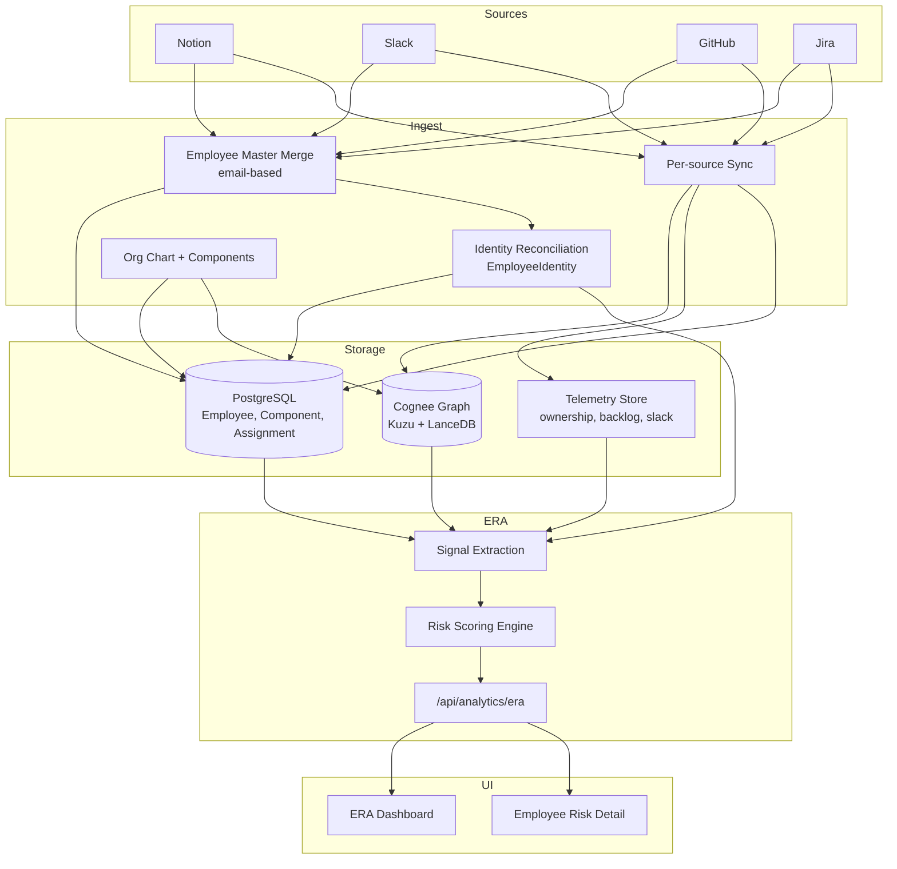
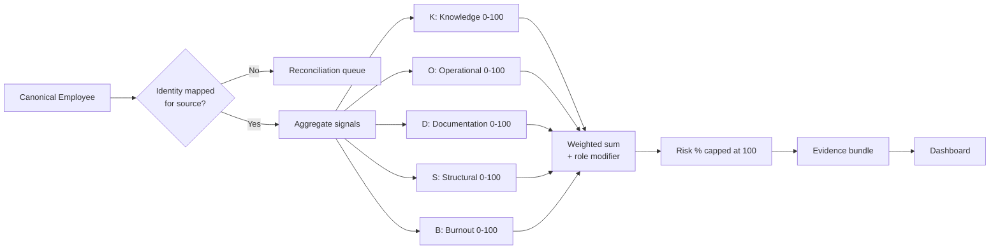
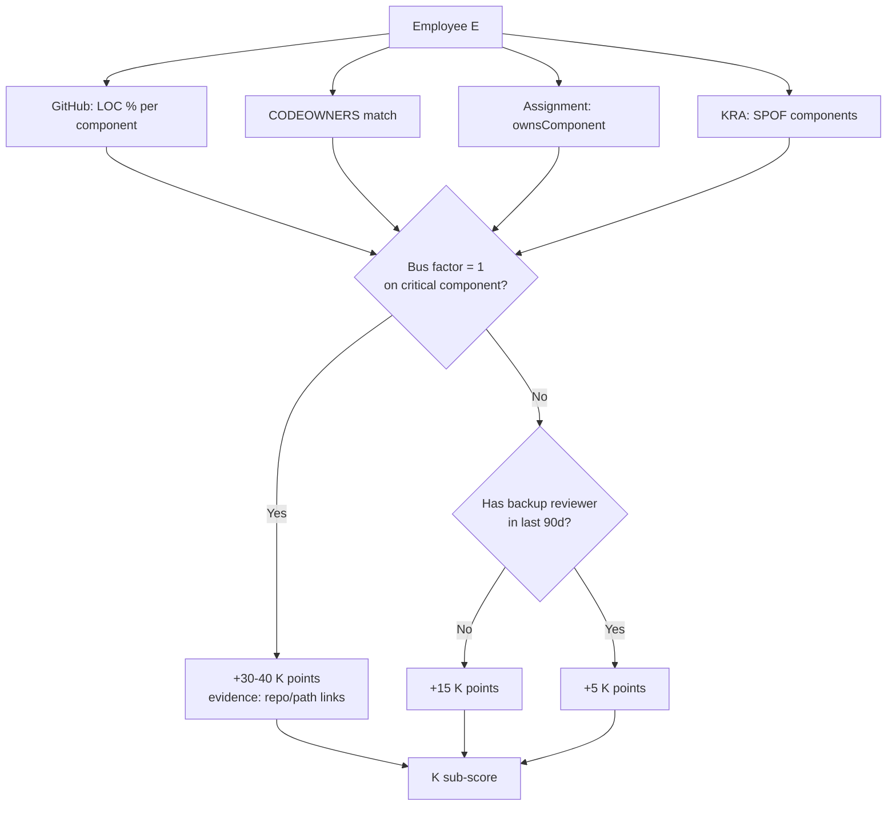

# Employee Risk Assessment (ERA) — Design Document

> **Implementation plans:** See [README.md](./README.md) for step-by-step guides (01–18).  
> **v2 improvements:** See [design-improvements.md](./design-improvements.md) for changes from this document’s original version, rationale, and industry references.  
> **Post–v1 follow-ups:** See [design-deferred.md](./design-deferred.md) for deferred reference features.

## Executive Summary

**Employee Risk %** answers: *If this person leaves tomorrow, how much operational and knowledge risk does the company take?*

It is not a performance score. It is a **bus-factor / continuity score** built from correlated signals across connectors (Notion, Slack, GitHub, Jira), unified through an **employee identity map**, stored in **Cognee** as a knowledge graph, and aggregated into a **0–100% risk score with explainable evidence**.

| Layer | Today | Gap |
|-------|-------|-----|
| Directory import | `fetchEmployeeMasterData` merges Notion/Slack/Jira/GitHub by email | Needs component ownership + tenure enrichment |
| Identity mapping | `EmployeeIdentity` per provider (`/api/identity`) | Needs to gate all telemetry joins |
| Cognee ingest | Org chart → `GraphEmployee` / `GraphComponent` + GitHub/Jira edges | Slack + Notion doc edges not yet wired |
| ERA score | 4-factor weighted formula in `era_analytics.py` | `undocumented_solved_incidents` is still synthetic; no evidence payloads |
| Dashboard | Table + bar breakdown in `EraDashboard` | Needs drill-down evidence, component graph, source links |

This document proposes a **production-grade ERA model** that extends what exists without replacing the architecture.

### Continuity risk vs departure probability

The **composite ERA score** measures **continuity risk** — operational and knowledge impact if the person were unavailable tomorrow. It is not a performance rating.

The **Burnout (B)** dimension captures overload signals that may correlate with departure risk. When B is elevated, the UI shows a separate **departure watchlist** badge without conflating attrition prediction into the main continuity score. See [design-improvements.md](./design-improvements.md).

### Data completeness

Risk scores account for which integrations are connected and identity-mapped:

- Per-provider coverage: `confirmed` | `high` | `missing` (not boolean)
- `data_completeness_pct` per employee (0–100)
- Missing connectors trigger **weight renormalization** across available dimensions and `partial` flags on affected dimensions

Unmapped external activity is **quarantined** — never attributed to a guessed employee. See [step-01-identity-foundation.md](./step-01-identity-foundation.md).

### Component criticality

Not all ownership is equal. Components carry a criticality tier:

| Tier | Label | Weight on K, O |
|------|-------|------------------|
| `tier1_revenue` | Revenue-critical | 1.5× |
| `tier2_core` | Core platform | 1.0× (default) |
| `tier3_support` | Internal / support | 0.6× |

80% ownership of a tier-1 payments service ranks higher than 80% of an internal tool.

---

## 1. What "Risk" Means (Definition)

Decompose risk into **five dimensions**. Each dimension produces a sub-score (0–100) and a list of **evidence items** (the "why").

| Dimension | Question it answers | Primary sources |
|-----------|---------------------|-----------------|
| **K — Knowledge concentration** | Do they alone own critical code/docs? | GitHub, Notion, Cognee graph |
| **O — Operational load** | Are they carrying unresolved work / incidents? | Jira, Slack, component DB |
| **D — Documentation gap** | Is tacit knowledge undocumented? | Notion, Slack threads, incident history |
| **S — Structural exposure** | Are they a bottleneck in org topology? | Notion/Slack org chart, assignments |
| **B — Burnout / availability** | Are they overloaded (leading indicator of departure)? | Jira velocity, GitHub after-hours, Slack on-call |

### Composite Risk Formula

```
Risk% = min(100, Σ (dimension_score × role_weight))
```

Suggested default weights for **individual contributors**:

| Dimension | Weight | Rationale |
|-----------|--------|-----------|
| K — Knowledge | 35% | Highest impact if they leave |
| O — Operational | 25% | Immediate delivery/incident pain |
| D — Documentation | 20% | Recovery time multiplier |
| S — Structural | 10% | Team topology risk |
| B — Burnout | 10% | Departure probability signal |

**Role-aware adjustments** (leadership is already skipped in KRA):

- **Managers / EMs**: lower K weight, higher S weight (span of control, single point of escalation).
- **On-call engineers**: higher O and B weights.
- **New hires (< 6 months tenure)**: lower absolute risk *unless* K is high (dangerous fast ownership).

The current v1 formula in `era_analytics.py` is a good heuristic but lacks dimension separation and evidence:

```
raw = (unresolved_issues × 5) + (open_tasks × 3) + (undocumented_solved_incidents × 10) + (codebase_share_pct × 0.4)
Risk% = min(100, raw)
```

---

## 2. Data Available Per Connector

### 2.1 Notion (Directory + Knowledge)

| Data | API / source | Maps to | ERA use |
|------|--------------|---------|---------|
| People DB: name, email, role, team | Database query | `Employee` | Identity anchor, role weights |
| Manager / Reports-to relation | Relation property | `Employee.manager_id` | Structural exposure (span, depth) |
| Start date / tenure | Date property | `Employee.tenure_years` | Tenure modifier |
| Component ownership pages | Page relations / tags | `Assignment` | K, S |
| Runbooks / architecture docs | Pages with `Owner`, `Component` | Cognee `documents` edges | D (coverage) |
| Project status pages | Status, owner | Open work proxy | O |
| Last edited date | Page metadata | Staleness signal | D |

**Risk signals:**

- Employee is **sole owner** on N component pages.
- Components they own have **no linked runbook** in Notion.
- Runbooks **not updated** in 90+ days but GitHub activity is high on that component.

### 2.2 Slack (Identity + Tacit Knowledge)

| Data | API | Maps to | ERA use |
|------|-----|---------|---------|
| `users.list` | email, display name, manager fields | `MasterDataRecord` | Directory + hierarchy |
| Channel membership | `conversations.members` | Employee ↔ channel | On-call / incident exposure |
| Message counts in incident channels | `conversations.history` | Telemetry per employee | D (tacit knowledge), B |
| Thread replies on `#incidents`, `#oncall` | History + threads | Incident participation | O, D |
| Reactions / mentions as SME | Search API | Expertise signals | K |
| PagerDuty/Opsgenie bot messages | Channel history | On-call rotations | O, B |

**Risk signals:**

- **Only responder** in 3+ incident threads for a component (tacit knowledge not in Notion).
- Member of **5+ critical channels** with >40% of messages (communication bottleneck).
- High **after-hours message volume** correlated with GitHub commits.

### 2.3 GitHub (Code Ownership)

| Data | API | Maps to | ERA use |
|------|-----|---------|---------|
| Commits / PRs (6–12 mo) | REST / GraphQL | `contributedTo`, `modifies` edges | K |
| CODEOWNERS file | Repo parse | Component → employee | K (authoritative) |
| PR reviews given/received | PR API | Backup depth | K (inverse — lowers risk) |
| Unique files touched | PR files | LOC ownership | K |
| Last commit per path | Commit history | Staleness / bus factor | K |
| Open PRs authored | PR state | Work in flight | O, B |
| Admin / maintain access | Org permissions | Critical access | S |

**Risk signals** (partially in `integration_telemetry.py` today):

- **>70% LOC ownership** on a component → SPOF.
- **Sole reviewer** on a service (no review reciprocity).
- **Only contributor** in 90 days on production paths.

### 2.4 Jira (Operational Load)

| Data | API | Maps to | ERA use |
|------|-----|---------|---------|
| Open issues assigned | JQL `assignee = X AND status != Done` | Per-employee counts | O |
| Unassigned high-priority bugs on owned components | JQL + component map | `jira_backlog_boost` (exists today) | O |
| Blockers / incidents | Issue type + priority | `unresolved_issues` | O |
| Story points in sprint | Sprint API | Load | B |
| Epic ownership | Epic link | Structural | S |
| Time in status | Changelog | Stuck work | B |
| Components / labels | Issue fields | Link to `Component` | Correlation |

**Risk signals:**

- **12+ open tickets**, 3+ P1/P2 (burnout + operational).
- **Unassigned critical bugs** on components they own (already modeled as `jira_backlog_boost`).
- **Single assignee** on all epics for a product area.

---

## 3. Identity Correlation (Critical Path)

All connectors use **different IDs**. The canonical join is:

```
Employee (canonical)
  └── EmployeeIdentity × {github, jira, slack, notion}
        └── provider_username_or_id
```

Implemented in `identity_mapping.py` with email-first auto-guess + manual override UI.

### Correlation rules (priority order)

1. **Email match** (strongest) — Slack profile email, Jira account email, GitHub commit email, Notion email property.
2. **Saved manual mapping** — user-confirmed in identity reconciliation UI.
3. **Fuzzy name match** — fallback only, flag as `confidence: low`.
4. **Reject** unmapped activity — never attribute to wrong employee.

### Per-employee activity join

```
FOR each telemetry event E:
  provider_user = E.author_id
  employee_id   = lookup(EmployeeIdentity, provider, provider_user)
  IF employee_id IS NULL → queue for reconciliation UI
  ELSE → aggregate into employee risk signals
```

---

## 4. End-to-End Pipeline

### Phase A — Bootstrap (one-time / onboarding)

1. **Connect integrations** (Slack, Notion, GitHub, Jira).
2. **Fetch employee directory** from Notion + Slack (primary) with Jira/GitHub as supplements (`fetch_employee_master_data`).
3. **Merge by email** → create `Employee` rows + org hierarchy.
4. **Identity reconciliation** → confirm `EmployeeIdentity` mappings per provider.
5. **Ingest org chart** → components, assignments, Cognee `ownsComponent` edges (`cognee_ingest.py`).
6. **Initial Cognee cognify** on org narrative.

### Phase B — Continuous sync (scheduled / on-demand)

7. **Per-source sync** (`process_external_app_sync`):
   - GitHub → PR/commit graph + ownership telemetry
   - Jira → ticket graph + backlog telemetry
   - Notion → doc pages + ownership tags → Cognee
   - Slack → channel/incident participation metrics
8. **Update operational DB** — `Component.open_tasks_count`, `unresolved_incidents`.
9. **Re-cognify** changed narratives in tenant dataset.

### Phase C — Risk computation (on sync complete or API request)

10. **Signal extraction** — per employee, per dimension, collect raw counts + evidence objects.
11. **Normalize to 0–100** per dimension (cap outliers, use percentiles within tenant).
12. **Apply role weights** → composite `risk_factor_score`.
13. **Classify** — low / medium / high (<40, 40–75, >75).
14. **Persist snapshot** (optional) — `EraRiskSnapshot` table for trends over time.

### Phase D — Dashboard render

15. **Team view** — sortable table, heatmap.
16. **Employee drill-down** — dimension radar + evidence cards with deep links to GitHub PR, Jira ticket, Notion page, Slack thread.

---

## 5. Flowcharts

### 5.1 High-level data flow



### 5.2 Per-employee scoring flow



### 5.3 Knowledge concentration (K) detail



---

## 6. Dimension Scoring Detail (Implementable)

### K — Knowledge Concentration (0–100)

> **Step 14:** Prefer DOA (Degree of Authorship) over raw LOC when GitHub is connected.

| Signal | Calculation | Evidence object |
|--------|-------------|-----------------|
| DOA / GitHub ownership | Max DOA or LOC % across components | `{component, pct, pr_links[]}` |
| Knowledge decay | Changes by others since last touch (Step 14) | `{file, decay_score}` |
| SPOF flag | Component with ≤1 contributor | `{component, last_contributors[]}` |
| Critical hotspot files | Step 13 quadrant | `{file, churn, quadrant}` |
| Assignment breadth | `owned_components / total_components` | `{components[]}` |
| Review backup | Step 15 review network | `{repos_without_backup[]}` |
| Cognee graph centrality | Node degree on `ownsComponent` + `modifies` | `{hop_count, nodes[]}` |

```
K = min(100,
    0.40 × max_github_ownership_pct
  + 0.25 × spof_component_count × 15
  + 0.20 × assignment_breadth_pct
  + 0.15 × (100 - backup_review_score)
)
```

### O — Operational Load (0–100)

| Signal | Source | Maps to existing field |
|--------|--------|------------------------|
| Unresolved incidents on owned components | Component DB | `unresolved_issues` |
| Jira unassigned P1/P2 on owned components | Jira telemetry | `jira_backlog_boost` |
| Open Jira tasks assigned | Jira API | `open_tasks` |
| Open GitHub PRs | GitHub API | new field |
| On-call incidents (30d) | Slack | new field |

```
O = min(100,
    unresolved_issues × 5
  + open_tasks × 3
  + jira_backlog_boost × 8
  + on_call_incidents × 4
)
```

### D — Documentation Gap (0–100)

Replace synthetic `_undocumented_solved_incidents` with real data:

| Signal | How to detect |
|--------|---------------|
| Solved incidents without Notion runbook update | Cross-reference Slack incident threads + Notion `last_edited` on linked runbook |
| Component has code activity but no Notion doc | GitHub activity > 0 AND no `documents` edge in Cognee |
| Employee answered incident threads but no doc authorship | Slack thread participation + zero Notion pages owned |
| Stale runbooks | Notion `last_edited` > 180 days, component still active |

```
D = min(100,
    undocumented_solved_incidents × 10
  + components_without_docs × 12
  + stale_runbook_count × 5
)
```

### S — Structural Exposure (0–100)

| Signal | Source |
|--------|--------|
| Direct reports count | Org chart |
| Sole owner of cross-team component | Assignments + team tags |
| Only Jira epic owner for area | Jira |
| Manager of team with high aggregate risk | Roll-up |

### B — Burnout / Availability (0–100)

| Signal | Source |
|--------|--------|
| Story points above team p90 | Jira |
| After-hours commits (weekends, 10pm–6am) | GitHub timestamp |
| PR cycle time increasing | GitHub |
| Slack messages in on-call channels outside hours | Slack |
| Long-tenure + rising load | Tenure + O trend |

---

## 7. Dashboard Design (Explainable ERA)

Full UI specification: [step-08-ui-command-center.md](./step-08-ui-command-center.md) (command center) and [step-09-ui-employee-detail.md](./step-09-ui-employee-detail.md) (drill-down).

### 7.1 Team overview (`/era`) — Command Center

Replace table-only layout with **ERA Command Center** — one-glance team posture:

| Section | Content |
|---------|---------|
| **Header** | Recovery estimate sentence, sync freshness, unmapped activity banner |
| **KPI strip** | Team avg risk (+ trend), high-risk count, SPOF, open P1, undocumented incidents, data health |
| **Risk heatmap** | Rows = employees; cols = K/O/D/S/B mini-bars + composite risk bar |
| **Top risk preview** | Auto-selected highest-risk employee: radar + top 3 evidence |
| **Team composition** | Donut by dimension driver; affected SPOF systems; identity gaps |
| **Evidence feed** | Team-wide stream of high-severity evidence items |

### 7.2 Employee detail panel (the "why" view)

When a row is selected, show:

#### A. Risk headline

```
Frank Osei — 82% Risk (HIGH)
"If Frank leaves, Payments and Auth recovery est. 3–6 weeks"
```

#### B. Dimension radar

5-axis radar: K, O, D, S, B — upgrade from the current 4-bar weighted chart.

#### C. Evidence cards

Each card = one attributable reason:

```
┌─────────────────────────────────────────────────────┐
│ 🔴 Knowledge SPOF — Payments Gateway (comp-payments) │
│ Frank owns 78% of commits in /payments/* (6 mo)    │
│ No backup reviewer on last 12 PRs                    │
│ Sources: GitHub • 3 PRs • 1 CODEOWNERS match         │
│ [View PRs] [View Component in KRA]                   │
└─────────────────────────────────────────────────────┘

┌─────────────────────────────────────────────────────┐
│ 🟠 Operational — 4 unassigned P1 bugs              │
│ On components Frank owns; no other assignee          │
│ Sources: Jira PROJ-441, PROJ-438, ...              │
│ [Open in Jira]                                       │
└─────────────────────────────────────────────────────┘

┌─────────────────────────────────────────────────────┐
│ 🟠 Documentation — 2 solved incidents undocumented │
│ #incidents threads resolved by Frank; no Notion edit │
│ Sources: Slack #payments-oncall (Jan 12, Feb 3)    │
│ [View thread] [Create runbook draft]                 │
└─────────────────────────────────────────────────────┘
```

#### D. Affected components mini-graph

Reuse KRA graph subset — employee node + owned components + SPOF highlight.

#### E. Mitigation recommendations (rule-based)

| Condition | Recommendation |
|-----------|----------------|
| K > 70, backup exists | Pair on next 2 PRs |
| K > 70, no backup | Assign backup owner in CODEOWNERS |
| D > 50 | Schedule runbook sprint |
| O > 60 | Redistribute Jira epics |
| B > 50 | Manager 1:1 flag, workload review |

#### F. Identity coverage footer

```
Mapped: GitHub ✓  Jira ✓  Slack ✓  Notion ✓
Last sync: GitHub 2h ago • Jira 2h ago • Slack 6h ago
```

### 7.3 API shape (proposed extension)

Full contract: [step-03-evidence-api-contract.md](./step-03-evidence-api-contract.md).

```typescript
interface EraAnalyticsResponse {
  computed_at: string;
  demo_mode: boolean;
  warnings: string[];
  team_summary: EraTeamSummary;
  employees: EraEmployeeMetrics[];
  unmapped_activity: { provider: string; count: number }[];
  sync_freshness: Record<string, string | null>;
  team_evidence_feed?: EraEvidenceItem[];
}

interface EraTeamSummary {
  avg_risk_score: number;
  high_risk_count: number;
  medium_risk_count: number;
  low_risk_count: number;
  spof_component_count: number;
  open_p1_count: number;
  undocumented_incident_count: number;
  top_risk_driver: string;
  estimated_recovery_weeks: { min: number; max: number };
  data_health_pct: number;
}

interface EraEmployeeMetrics {
  // existing
  employee_id: string;
  name: string;
  role: string;
  email: string;
  unresolved_issues: number;
  open_tasks: number;
  undocumented_solved_incidents: number;
  codebase_share_pct: number;
  risk_factor_score: number;
  risk_level: string;
  jira_backlog_boost: number;

  // new
  dimensions: {
    knowledge: number;
    operational: number;
    documentation: number;
    structural: number;
    burnout: number;
    partial?: Record<string, boolean>;
  };
  evidence: EraEvidenceItem[];
  evidence_total_count: number;
  affected_components: {
    id: string;
    name: string;
    spof: boolean;
    criticality: string;
    ownership_pct?: number;
  }[];
  identity_coverage: Record<string, "confirmed" | "high" | "missing">;
  data_completeness_pct: number;
  recovery_estimate_weeks?: { min: number; max: number };
  departure_watchlist?: boolean;
  trend_7d?: number | null;
  computed_at: string;
}

interface EraEvidenceItem {
  dimension: "knowledge" | "operational" | "documentation" | "structural" | "burnout";
  severity: "high" | "medium" | "low";
  title: string;
  description: string;
  impact_points: number;
  sources: { provider: string; label: string; url: string }[];
}
```

---

## 8. Cognee's Role

Cognee enables **multi-hop reasoning** that SQL tables cannot easily do:

| Query | Graph traversal |
|-------|-----------------|
| "What does Frank know?" | `Frank → ownsComponent → Component → modifies ← PR` |
| "What breaks if Frank leaves?" | `Frank → ownsComponent → blocksComponent ← JiraTicket` |
| "Is knowledge documented?" | `Component → documentedBy → NotionPage` (missing edge = gap) |
| "Who else could cover?" | `Component → contributedTo ← OtherEmployee` (backup candidates) |

**Ingestion strategy:**

- **Structured edges** via `add_data_points` (GitHub PR, Jira ticket — already implemented).
- **Unstructured narrative** via `add + cognify` (Notion page content, Slack incident summaries).
- **ERA reads** primarily from materialized telemetry + DB; **Cognee search** powers evidence enrichment and backup-candidate suggestions in the detail panel.

---

## 9. Implementation Plan (Phased)

Detailed step plans: [README.md](./README.md).

| Phase | Steps | Focus |
|-------|-------|-------|
| Foundation | 01, 02, 03 | Identity gate, scoring engine, API v2 |
| UI | 08, 09 | Command center + employee detail |
| Connectors | 04, 05, 06, 07 | GitHub, Jira, Notion, Slack telemetry |
| Git intelligence | 14, 15, 13 | DOA, review network, file risk matrix |
| Intelligence | 10, 11, 18 | Cognee queries, snapshots, org health |
| Actions & workflow | 12, 16, 17 | Mitigations, Exit bridge, alerts |

**Recommended build order:** 01 → 02 → 03 → 08 → 04 → 14 → 15 → 05 → 09 → 13 → 06 → 07 → 10 → 11 → 12 → 16 → 17 → 18

**Time estimate:** 73–103 developer-days (~15–21 weeks @ 1 FTE, ~8–11 weeks @ 2 FTEs). See [README.md](./README.md).

---

## 14. Reference-inspired features (in scope)

Feasible patterns from [ContributorIQ](https://contributoriq.com/), [CodePulse](https://codepulsehq.com/), and [WorkFera](https://www.workfera.com/) incorporated into Steps 13–18 and existing steps:

| Capability | Step | Description |
|------------|------|-------------|
| DOA ownership | 14 | Fritz et al. authorship model; knowledge decay |
| File hotspot matrix | 13 | Churn × contributor quadrant on KRA/ERA |
| Review network | 15 | Who reviews whom; backup candidate boost |
| Risky PR detection | 15 | Merged without review, SPOF file touches |
| ERA → Exit pre-fill | 16 | Handover markdown from ERA evidence |
| Proactive alerts | 17 | SPOF, P1, stale sync → in-app / Slack |
| Knowledge risk review cadence | 17 | Monthly EM review ritual |
| Orphan file tracking | 18 | Post-departure knowledge loss |
| Organization health score | 18 | Team resilience KPI (complements avg ERA risk) |
| Living runbooks | 06 | Ownership transfer Notion template |
| Escalation routing signal | 07 | Repeated incident @mentions → S |

**Deferred (post–v1):** DX surveys, leaderboards, DevFinOps, external benchmarks, M&A export — see [design-deferred.md](./design-deferred.md).

---

## 10. Correlation Example (Walkthrough)

**Employee:** Alice Chen (`emp-alice-chen`)

| Source | Raw ID | Mapped via |
|--------|--------|------------|
| Notion | `notion-alice` | Email `alice.chen@acme.com` |
| Slack | `U01ALICE` | Email |
| GitHub | `gh-alicechen` | Saved mapping |
| Jira | `jira-alice` | Email |

**After sync:**

| Signal | Value | Dimension |
|--------|-------|-----------|
| 82% LOC on `comp-auth` | GitHub DOA telemetry (Step 14) | K = 78 |
| 2 unassigned P1 bugs on `comp-auth` | Jira telemetry | O += 16 |
| 6 open Jira tasks | Jira API | O += 18 |
| Auth runbook not updated in 200 days | Notion | D = 45 |
| Resolved 2 incidents in #identity-team, no doc | Slack + Notion gap | D += 20 |
| 3 direct reports, 2 are high-risk | Org chart roll-up | S = 35 |
| 14 PRs this sprint, 3 after-hours | GitHub | B = 55 |

**Composite:**

```
Risk = 0.35×78 + 0.25×34 + 0.20×65 + 0.10×35 + 0.10×55 = 58.2% → MEDIUM
```

**Top evidence shown in UI:**

1. 82% auth codebase ownership via DOA (GitHub, 4 PR links)
2. 2 undocumented incident resolutions (Slack threads)
3. Stale auth runbook (Notion page link)
4. 3 critical-quadrant hotspot files on Payments (Step 13)

---

## 11. Key Design Principles

1. **Explainability over precision** — managers need to trust the score; every point needs a source link.
2. **Email-first identity** — never guess silently; surface low-confidence mappings.
3. **Role-aware weights** — an EM's risk profile differs from an IC's.
4. **Separate ERA (people) from KRA (components)** — ERA is "who", KRA is "what"; cross-link in the detail panel.
5. **Materialize for speed** — compute on sync, serve from cache; Cognee for deep queries only.
6. **Cap at 100, use percentiles** — avoid one outlier dominating; normalize within tenant.

---

## 12. Mapping to Codebase

| This document | Existing file |
|---------------|---------------|
| Directory import | `backend/app/services/employee_master_fetch.py` |
| Identity mapping | `backend/app/services/identity_mapping.py`, `/api/identity` |
| Org + Cognee ingest | `backend/app/services/cognee_ingest.py` |
| GitHub/Jira sync | `backend/app/services/integration_sync.py` |
| Ownership / backlog telemetry | `backend/app/services/integration_telemetry.py` |
| ERA scoring | `backend/app/services/era_analytics.py` |
| Contribution share | `backend/app/services/cognee_era_metrics.py` |
| SPOF (KRA overlap) | `backend/app/services/kra_analytics.py`, `is_github_spof()` |
| ERA UI | `frontend/src/components/era/EraDashboard.tsx`, `EraRiskChart.tsx` |

---

## 13. Industry references

Comparable products and patterns (full analysis in [design-improvements.md](./design-improvements.md)):

| Category | Products | Relevant pattern |
|----------|----------|------------------|
| Bus factor / key-person risk | [ContributorIQ](https://contributoriq.com/use-cases/departure-risk), [CodePulse](https://codepulsehq.com/features/knowledge-silos), [WorkFera](https://www.workfera.com/solutions/knowledge-risk-review) | Heatmaps, transfer priority lists, backup identification |
| Engineering management | [Jellyfish](https://jellyfish.co/), [DX](https://getdx.com/), [Swarmia](https://www.swarmia.com/) | Executive KPI strips, data confidence, team roll-ups |
| Concept | [Bus Factor (Laws of Software Engineering)](https://lawsofsoftwareengineering.com/laws/bus-factor/) | Knowledge distribution, mitigation practices |

**Empulse differentiators:** multi-source correlation (not Git-only), Cognee graph blast-radius, operational + documentation dimensions, unified ERA/KRA/Exit cockpit, DOA + file matrix depth from bus-factor tools.

---

## 15. Design verification checklist

| Check | Status |
|-------|--------|
| Identity gate before all attribution (Step 01) | Specified |
| Five dimensions with evidence payloads (Steps 02–03) | Specified |
| Backward-compatible API fields for v1 UI | Specified |
| GitHub live sync before DOA/matrix (04 → 14 → 13) | Dependency order correct |
| ERA (people) vs KRA (files/components) separation | Maintained |
| Exit module reuse, not duplicate (Step 16) | Specified |
| Non-surveillance framing (alerts to channels) | Step 17 |
| Infeasible items isolated in design-deferred.md | Done |
| Per-step estimates sum to 73–103 d | README |
| Maps to existing codebase files (Section 12) | Valid |
