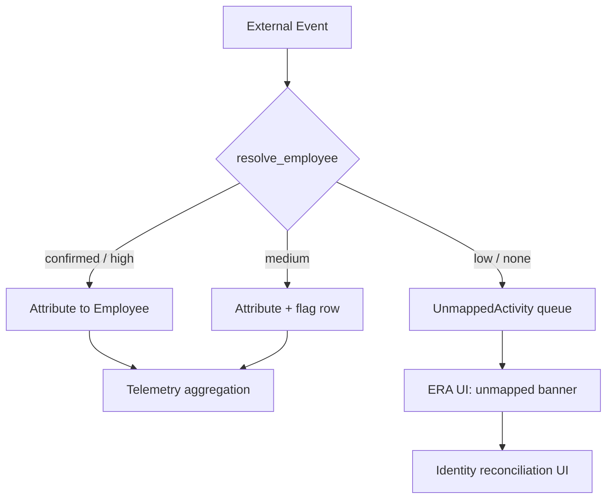

# Step 01 — Identity Foundation

**Depends on:** —  
**Blocks:** 02, 04, 05, 06, 07  
**Estimate:** 3–5 days

## Goal

Every telemetry event resolves to exactly one canonical `Employee`, or is explicitly quarantined. No silent mis-attribution.

## Background

Today `identity_mapping.py` auto-guesses mappings by email and name, but `integration_telemetry.py` attributes mock GitHub/Jira activity by hard-coded `author_employee_id` without passing through an identity gate.

## Architecture



## Tasks

### 1.1 `resolve_employee()` service

```python
def resolve_employee(
    db: Session,
    tenant_id: UUID,
    provider: str,
    provider_user_id: str,
    *,
    email_hint: str | None = None,
) -> ResolveResult:
    """
    Returns employee_id, confidence, and match_method.
    """
```

**Lookup order:**

1. `EmployeeIdentity` row for `(tenant, employee, provider)` — confidence `confirmed`
2. Email exact match against `Employee.email` — confidence `high`
3. Fuzzy name match — confidence `medium`
4. No match — confidence `none`

### 1.2 Confidence model

| Level | Rule | Attribution |
|-------|------|-------------|
| `confirmed` | User saved mapping via `PUT /api/identity/mappings` | Full |
| `high` | Email exact match | Full |
| `medium` | Fuzzy name match | Full + `identity_warning` on employee |
| `low` | Partial match (deprecated path) | Quarantine |
| `none` | No match | Quarantine |

### 1.3 `UnmappedActivity` model

```python
class UnmappedActivity(Base):
    __tablename__ = "unmapped_activities"
    id: UUID
    tenant_id: UUID
    provider: str          # github|jira|slack|notion
    provider_user_id: str
    provider_label: str | None
    event_type: str        # commit|pr|issue|message|page_edit
    payload_json: dict
    occurrence_count: int
    first_seen_at: datetime
    last_seen_at: datetime
```

**Aggregation:** Upsert by `(tenant, provider, provider_user_id, event_type)`.

### 1.4 Gate integration sync

Update `process_external_app_sync` and telemetry applicators:

```
FOR each event with author:
    result = resolve_employee(...)
    IF result.confidence in (confirmed, high, medium):
        attribute to result.employee_id
    ELSE:
        upsert UnmappedActivity
        SKIP attribution
```

### 1.5 API extensions

```
GET /api/identity/unmapped?provider=github
GET /api/identity/reconciliation  # add unmapped_count per provider
```

### 1.6 Reconciliation UI requirements (feeds Step 08)

- Banner when `unmapped_count > 0`
- Link to Settings → Identity mapping
- Show top unmapped labels (e.g. `contractor-bot`, `gh-ext-001`)

## Edge cases

| Case | Behavior |
|------|----------|
| Same email, duplicate Notion rows | Merge into one `Employee`; log `duplicate_source_ids[]` in ingest audit |
| GitHub bot / service account | Exclude via `type=Bot` or org allowlist; never create Employee |
| Contractor, no Slack email | Quarantine; optional tenant setting `include_contractors_in_era` |
| Employee deleted in Slack | `Employee.active = false`; exclude from default ERA; retain history |
| Name change, same email | Update `Employee.name`; preserve `employee_id` |
| Shared team inbox email | Never auto-match; force manual mapping |
| Two GitHub accounts, one person | One `EmployeeIdentity` per provider — UI must pick primary; document merge workflow |
| Mapped GitHub, not Jira | `identity_coverage.jira = missing`; dimension weights renormalize |
| Acme demo fallback | No identity gate on demo data; API sets `demo_mode: true` |
| Email case sensitivity | Always normalize to lowercase for match |
| Plus-addressing (`user+tag@corp.com`) | Match on normalized local-part policy (document per tenant) |
| Reconciliation mid-sync | Sync uses snapshot of mappings at start; next sync picks up new mappings |

## Testing

- [ ] Event with confirmed mapping → attributes correctly
- [ ] Event with no mapping → quarantine, not counted on any employee
- [ ] Medium confidence → attributes + warning flag
- [ ] Two employees, same fuzzy name → both flagged; no auto medium match if ambiguous
- [ ] `unmapped_count` decreases after mapping saved

## Exit criteria

- [ ] 100% of production sync events pass through `resolve_employee`
- [ ] Zero attributed events without `confirmed` or `high` unless `medium` with warning
- [ ] Reconciliation API returns accurate `unmapped_count`

## Files to touch

- `backend/app/models/operational.py` — `UnmappedActivity`, `EmployeeIdentity.confidence`
- `backend/app/services/identity_resolver.py` — new
- `backend/app/services/integration_sync.py`
- `backend/app/services/integration_telemetry.py`
- `backend/app/routes/identity.py`
- `frontend/src/app/settings/` — identity reconciliation enhancements
