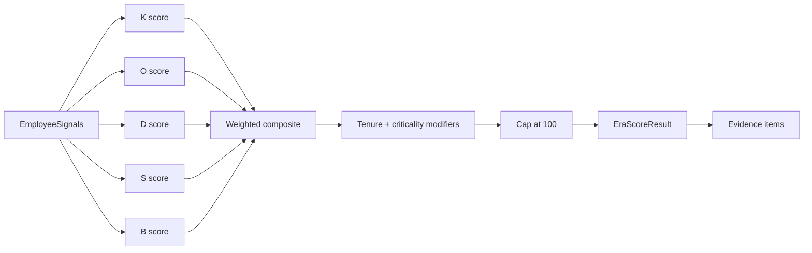

# Step 02 — Scoring Engine

**Depends on:** 01  
**Blocks:** 03, 14 (DOA feeds K)  
**Estimate:** 4–6 days

## Goal

Replace the monolithic v1 formula with five explainable dimensions, role-aware composite scoring, tenant normalization, and component criticality weighting.

## Current state

```python
# era_analytics.py
raw = (unresolved_issues * 5) + (open_tasks * 3) + (undocumented * 10) + (codebase_share_pct * 0.4)
```

`_undocumented_solved_incidents` is synthetic (`sum(ord(char)) % 6`).

## Architecture



## Module structure

```
backend/app/services/era/
  __init__.py
  signals.py          # EmployeeSignals dataclass
  dimensions.py       # compute_k, compute_o, ...
  composite.py        # role weights, tenure modifier
  normalize.py        # tenant percentiles
  evidence.py         # build EraEvidenceItem list
  types.py            # DimensionResult, EraScoreResult
```

## Dimension formulas

### K — Knowledge (0–100)

> **Step 14 (DOA):** When GitHub is connected, prefer DOA-based ownership over LOC %. Until Step 14 ships, use LOC from Step 04 mock/live telemetry.

```
K = min(100,
    0.40 × max_doa_or_github_ownership_pct × criticality_weight
  + 0.25 × min(100, spof_component_count × 15)
  + 0.20 × assignment_breadth_pct
  + 0.15 × (100 - backup_review_score)   # Step 15 review network
)
```

**Evidence triggers:**

- `max_doa_or_github_ownership_pct >= 70` → high severity (Step 14)
- `is_github_spof(component)` → high severity
- `backup_review_score < 30` → medium severity (Step 15)
- Critical-quadrant hotspot file (Step 13) → high severity

### O — Operational (0–100)

Use **normalized** open tasks and unresolved counts where possible.

```
O = min(100,
    norm(unresolved_issues) × 0.35
  + norm(open_tasks) × 0.25
  + jira_backlog_boost × 8 × 0.20
  + norm(open_prs) × 0.10
  + norm(on_call_incidents_30d) × 0.10
)
```

Legacy linear formula retained as fallback when percentile cache empty.

### D — Documentation (0–100)

```
D = min(100,
    undocumented_solved_incidents × 10
  + components_without_docs × 12
  + stale_runbook_count × 5
)
```

Until Step 06/07 ship, fall back to v1 synthetic with `evidence[].synthetic: true` flag.

### S — Structural (0–100)

```
S = min(100,
    min(40, direct_reports × 8)
  + cross_team_sole_owner_count × 15
  + sole_epic_owner_count × 10
  + high_risk_report_roll_up × 0.15
)
```

Leadership roles: return `excluded: true` (match KRA).

### B — Burnout / availability (0–100)

**Continuity modifier only** — also expose `departure_watchlist: bool` when B > 60.

```
B = min(100,
    norm(sprint_points) × 0.30
  + norm(after_hours_commits) × 0.25
  + pr_cycle_time_trend × 0.20
  + norm(on_call_off_hours_messages) × 0.15
  + rising_load_trend × 0.10
)
```

## Role weight profiles

```python
ROLE_WEIGHTS = {
    "ic":       {"K": 0.35, "O": 0.25, "D": 0.20, "S": 0.10, "B": 0.10},
    "manager":  {"K": 0.20, "O": 0.20, "D": 0.15, "S": 0.30, "B": 0.15},
    "on_call":  {"K": 0.30, "O": 0.30, "D": 0.15, "S": 0.10, "B": 0.15},
}
```

**Role detection:**

- `is_leadership_role(role)` → exclude
- `direct_reports > 0` → manager
- `on_call_rotation_active` → on_call (from Slack/PagerDuty, Step 07)
- else → ic

## Tenure modifier

```python
if tenure_months < 6 and K < 50:
    composite *= 0.85
elif tenure_months < 6 and K >= 70:
    composite *= 1.10   # dangerous fast ownership
elif tenure_months > 60 and K > 80:
    composite *= 1.05   # legacy single-owner
```

## Component criticality

Add to `Component` model:

```python
criticality: str = "tier2_core"  # tier1_revenue | tier2_core | tier3_support
```

| Tier | Weight multiplier on K, O |
|------|---------------------------|
| tier1_revenue | 1.5 |
| tier2_core | 1.0 |
| tier3_support | 0.6 |

Default tier2 if unset.

## Tenant percentile normalization

```python
def normalize(value: float, tenant_stats: TenantPercentiles, key: str) -> float:
    p90 = max(tenant_stats.p90.get(key, 1), 1)
    return min(100.0, (value / p90) * 100)
```

Recompute `TenantPercentiles` on each ERA computation from current employee signal set.

## Missing connector renormalization

If `identity_coverage.github == missing`, zero out K signals from GitHub and redistribute K's weight across remaining dimensions proportionally. Set `dimensions.knowledge.partial = true`.

## Recovery estimate heuristic

```python
weeks_min = spof_count * 2 + (D // 20)
weeks_max = weeks_min + owned_component_count + (K // 15)
```

Clamp to `[1, 26]`. Display as range on UI.

## Edge cases

| Case | Handling |
|------|----------|
| Zero assignments | K from GitHub-only; evidence notes "no formal component ownership" |
| All dimensions 0 | Risk 0, low; evidence "insufficient data" |
| Score > 100 before cap | Store `pre_cap_score` in debug field |
| Tied composite scores | Sort by K desc, then O desc |
| Single employee tenant | Skip percentile norm; use absolute thresholds |
| FTE < 0.5 | Optional `composite *= 0.9` tenant setting |
| Inactive employee | Skip ERA computation |
| Partial connectors | Renormalize + `data_completeness_pct` |

## Backward compatibility

Populate legacy fields on `EraEmployeeMetrics`:

- `unresolved_issues`, `open_tasks`, `undocumented_solved_incidents`, `codebase_share_pct` from signal inputs
- `risk_factor_score`, `risk_level` from composite

## Testing

- Golden file: Alice walkthrough → ~58.2% medium
- Frank high-K scenario → high, >= 75
- Leadership employee → excluded from list
- GitHub-missing employee → partial K, renormalized composite

## Exit criteria

- [ ] Pure functions with unit tests per dimension
- [ ] `get_era_metrics()` uses new engine behind feature flag `ERA_V2_SCORING`
- [ ] Evidence items generated for top 5 factors per employee

## Files to touch

- `backend/app/services/era_analytics.py` — orchestrator
- `backend/app/services/era/` — new package
- `backend/app/models/operational.py` — `Component.criticality`
- `backend/app/schemas/era.py` — extended models
