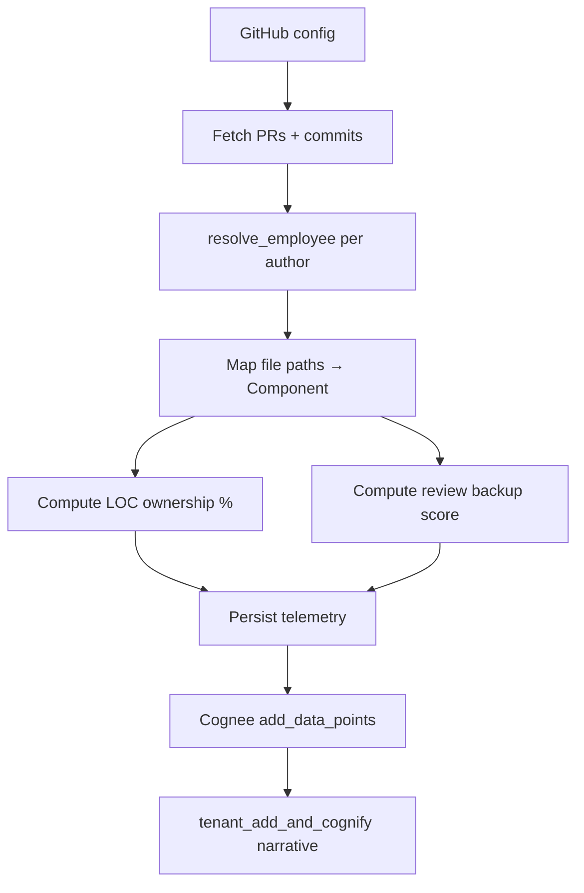

# Step 04 — GitHub Telemetry

**Depends on:** 01  
**Blocks:** 03, **14** (DOA), **15** (reviews), **13** (matrix)  
**Estimate:** 5–7 days (base sync); **+5–8 days** with Step 14 DOA

## Related steps

- [step-14-doa-ownership.md](./step-14-doa-ownership.md) — replaces LOC % for K dimension
- [step-15-review-network-risky-changes.md](./step-15-review-network-risky-changes.md) — PR review graph
- [step-13-file-risk-matrix-hotspots.md](./step-13-file-risk-matrix-hotspots.md) — file-level quadrants

## Goal

Replace `MOCK_GITHUB_ACTIVITY` with real GitHub API ingestion, CODEOWNERS parsing, review graphs, and SPOF detection feeding K, O, and B dimensions.

## Current state

- `integration_telemetry.apply_github_telemetry()` uses mock feed
- `GraphPullRequest` DataPoints ingested to Cognee
- LOC ownership and SPOF flags in memory dict `_github_ownership`

## Data to pull

| Data | API | Window | ERA dimension |
|------|-----|--------|---------------|
| Merged PRs + files changed | GraphQL / REST | 6 months | K |
| Commits on default branch | REST | 6 months | K |
| PR reviews given/received | GraphQL | 6 months | K (backup) |
| Open PRs by author | REST | current | O, B |
| CODEOWNERS | Repo file API | current | K (authoritative) |
| Contributor stats per path | Derived | 6 months | K, SPOF |
| Commit timestamps | Commit API | 6 months | B (after-hours) |

## Pipeline



## Path → component mapping

Priority:

1. Explicit mapping in integration config (`path_prefix → component_id`)
2. CODEOWNERS team → component from org chart
3. Repo name → single component (monorepo exception: require prefix map)

**Edge:** unmapped paths → `unmapped_paths[]` audit log, not attributed to components.

## Ownership calculation

Per component, per employee:

```
loc_weight = sum(loc_added + loc_removed) per file in component
ownership_pct = loc_weight / total_loc_weight * 100
```

Deduplicate squash merges: count PR once by `merge_commit_sha`.

## SPOF detection

```python
spof_components = {
    c for c, contributors in ownership.items()
    if len(contributors) >= 1 and max(contributors.values()) > 85
}
```

Align with `is_github_spof()` in KRA.

## Review backup score (0–100)

Per employee on owned components:

```
backup_review_score = min(100, unique_reviewers_on_their_prs * 15)
```

If 0 reviewers in 90d → evidence "No backup reviewer on last N PRs".

## Evidence items generated

| Condition | Title template |
|-----------|----------------|
| ownership > 70% | "{name} owns {pct}% of {component}" |
| SPOF | "Sole contributor on {component}" |
| no reviews | "No backup reviewer on last {n} PRs" |
| open PRs > 5 | "{n} open pull requests" |

## Edge cases

| Case | Handling |
|------|----------|
| Squash merge double-count | Dedupe by PR number |
| Fork PRs | Exclude unless from org member |
| Deleted GitHub user | `author: ghost` → quarantine |
| Renamed repo | Track by repo id if available |
| Monorepo, no path map | Warn; attribute to `default` component only |
| Bot commits | Filter `author.type == Bot` |
| Co-authored commits | Split LOC 50/50 or attribute to primary author |
| External contractor org | Map via identity; else quarantine |
| Rate limits | Paginate; resume cursor; partial sync + warning |
| Large repo (>10k PRs) | Sample last 6 months with `since=` param |
| CODEOWNERS syntax errors | Log warning; fall back to LOC-only |

## Storage

Persist to DB (replace in-memory dict):

```python
class GitHubOwnershipSnapshot(Base):
    tenant_id, component_id, employee_id, ownership_pct, computed_at
```

Refresh on each `process_external_app_sync("github")`.

## Config requirements

From `GitHubConfigRequest`:

- `repository_url` or org-level scope
- `personal_access_token` with `repo` read
- Optional `path_component_map: dict[str, str]`

## Testing

- Fixture repo with 2 contributors → correct ownership split
- Single contributor repo → SPOF flagged
- Unmapped author → quarantine, not in ownership

## Exit criteria

- [ ] Live sync populates ownership without mock feed
- [ ] K dimension uses real ownership (LOC interim; DOA after Step 14)
- [ ] Evidence links to real PR URLs
- [ ] `has_github_sync()` true after successful run
- [ ] Ready for Step 14 DOA computation on same sync hook

## Files to touch

- `backend/app/services/integration_sync.py`
- `backend/app/services/integration_telemetry.py`
- `backend/app/services/github_client.py` — new
- `backend/app/services/integration_feeds.py` — deprecate mock for prod
