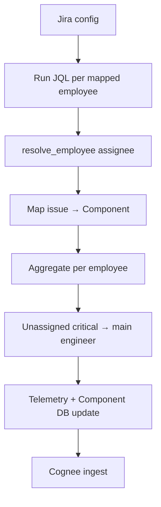

# Step 05 — Jira Telemetry

**Depends on:** 01  
**Blocks:** 03 (live O signals)  
**Estimate:** 4–6 days

## Goal

Replace `MOCK_JIRA_ISSUES` with live Jira REST/API ingestion for assigned work, unassigned critical bugs on owned components, epic ownership, and sprint load.

## Current state

- `apply_jira_telemetry()` maps unassigned high-priority bugs to component's main engineer (`jira_backlog_boost`)
- `GraphJiraTicket` DataPoints to Cognee

## Data to pull

| Data | JQL / API | ERA dimension |
|------|-----------|---------------|
| Open issues assigned to user | `assignee = X AND statusCategory != Done` | O |
| Unassigned P1/P2 bugs on component | Custom JQL + component field | O (`jira_backlog_boost`) |
| Incidents / blockers | `issueType in (Bug, Incident) AND priority in (Highest, High)` | O |
| Story points in active sprint | Sprint API + assignee | B |
| Epics where user is owner | `issuetype = Epic AND assignee = X` | S |
| Time in status | Changelog API | B |
| Component / label mapping | Issue fields | Correlation |

## Pipeline



## `jira_backlog_boost` (extend existing)

For each open issue where:

- `assignee` is empty
- `priority` in {Highest, High} (configurable)
- `issue_type` in {Bug, Incident}
- `component_id` maps to org component

→ increment backlog for `_main_engineer_for_component()`.

**Evidence:** "4 unassigned P1 bugs on components you own"

## Component mapping

| Jira field | Maps to |
|------------|---------|
| Components (classic) | `Component.id` via config map |
| Labels `component:auth` | `comp-auth` |
| Project key | default component per project |

## Per-employee aggregates

```python
@dataclass
class JiraEmployeeSignals:
    open_tasks: int
    open_p1_p2: int
    unassigned_on_owned: int      # feeds jira_backlog_boost attribution
    epic_owner_count: int
    sprint_points: float
    avg_days_in_status: float
```

## Update operational DB

On sync, refresh `Component.open_tasks_count` and `Component.unresolved_incidents` from Jira counts per component.

## Edge cases

| Case | Handling |
|------|----------|
| Shared assignee (multiple) | Count full issue per assignee |
| Subtasks vs parents | Count parents only for open_tasks; include subtasks in points |
| Done but not closed | Use `statusCategory` not status name |
| Jira Service Management | Map incidents separately; higher O weight |
| Custom priority names | Config map `priority_field → severity` |
| No component on issue | Skip component linkage; optional team-level O |
| Deleted Jira user | Quarantine via identity |
| Rate limits | Batch JQL; `POST /search` with pagination |
| Epic without assignee | Use epic reporter or custom Owner field |
| Multiple components on issue | Attribute fractional credit or primary component |

## Evidence items

| Condition | Title |
|-----------|-------|
| open_p1_p2 >= 3 | "{n} high-priority open issues" |
| jira_backlog_boost > 0 | "{n} unassigned critical bugs on owned components" |
| sprint_points > p90 | "Sprint load above team norm" |
| sole epic owner | "Single owner of {n} epics in {area}" |

## Testing

- Mock Jira API with fixture issues
- Unassigned P1 on comp-payments → boost to main engineer
- Mapped assignee → open_tasks increment

## Exit criteria

- [ ] `has_jira_sync()` after live run
- [ ] `open_tasks`, `unresolved_issues`, `jira_backlog_boost` from real data
- [ ] Evidence links to `https://{site}/browse/{key}`

## Files to touch

- `backend/app/services/integration_sync.py`
- `backend/app/services/integration_telemetry.py`
- `backend/app/services/jira_client.py` — new
- `backend/app/services/integration_feeds.py`
