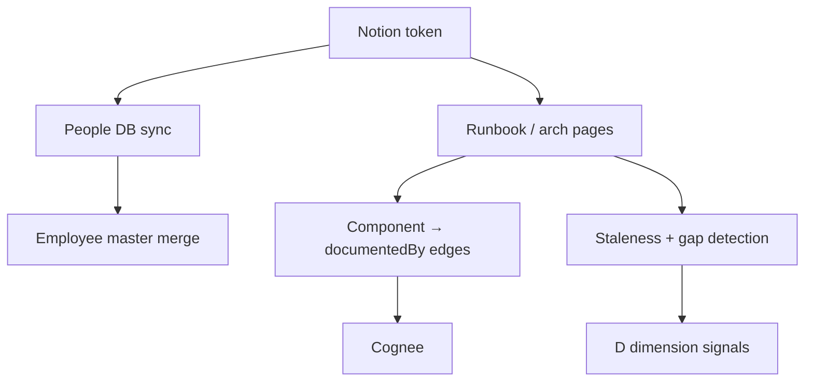

# Step 06 — Notion Telemetry

**Depends on:** 01  
**Blocks:** 03 (live D signals), 10, 16  
**Estimate:** 5–7 days  
**Reference:** WorkFera living runbooks, Guru expert tags

## Living runbooks & ownership transfer (WorkFera)

Notion template sections for component ownership transfer:

- Architecture decisions and constraints
- Incident history with root causes
- Vendor relationships and escalation paths
- Access maps and safe-change boundaries
- `last_verified_at` property — quarterly verification cadence

ERA mitigation (Step 12): “Generate ownership transfer page from template” when D > 50.

## Expertise tags (Guru pattern)

If People DB has `Expertise` or `Skills` multi-select:

- Sole tagged expert on `tier1` topic → K evidence
- Map to Cognee `expertOn` edges (Step 10)

## Goal

Ingest Notion people data, component ownership pages, and runbook metadata to power Documentation (D) dimension and structural assignments.

## Current state

- `fetch_notion_member_records` used in `employee_master_fetch.py`
- KRA references mock `DOCUMENTATION_SOURCES`
- No live Notion → Cognee doc edges

## Data to pull

| Data | Notion API | ERA use |
|------|------------|---------|
| People database | `databases.query` | Directory, tenure, manager |
| Runbook / architecture pages | Search or linked DB | D — coverage |
| Page `last_edited_time` | Pages API | D — staleness |
| Owner / Author properties | Page properties | K, D |
| Component relation on pages | Relation property | `Assignment`, doc ↔ component |
| Project status pages | DB query | O proxy |

## Pipeline



## Documentation gap detection

### Gap type 1: No runbook for active component

```
IF component has github_activity_90d > 0
AND no Notion page linked (relation or tag)
THEN components_without_docs += 1
```

### Gap type 2: Stale runbook

```
IF linked runbook last_edited > 180 days ago
AND github_activity_90d > 0
THEN stale_runbook_count += 1
```

### Gap type 3: Employee authored no docs but high Slack incident participation

(Requires Step 07 cross-reference)

```
IF slack_incident_resolutions >= 2
AND notion_pages_owned == 0
THEN undocumented_solved_incidents += 1
```

## Cognee edges

```python
class GraphNotionPage(DataPoint):
    page_id: str
    title: str
    last_edited: str
    documentedBy: Component  # or reverse edge per cognee pattern
```

## People DB → org chart

- Manager relation → `manager_id`
- Start date → `tenure_years`
- Team → `team_name`
- Component ownership relation → `Assignment` rows

## Edge cases

| Case | Handling |
|------|----------|
| Private page (403) | Log gap; don't crash; evidence "doc exists but inaccessible" |
| Archived pages | Exclude from active doc count |
| Wiki vs database | Support both; normalize to `GraphNotionPage` |
| Multiple runbooks per component | Use most recently edited for staleness |
| Page without owner property | Use last editor as weak signal |
| Notion integration token scoped wrong | Clear error in sync status |
| Duplicate page titles | Dedupe by `page_id` |
| Empty people DB | Fall back to Slack directory only |
| Rate limits (3 req/s) | Queue with backoff |

## Evidence items

| Condition | Title |
|-----------|-------|
| stale runbook | "Runbook for {component} not updated in {n} days" |
| no doc | "{component} has code activity but no Notion runbook" |
| sole page owner | "Only author of {n} critical runbooks" |

## Testing

- Fixture Notion responses
- Component with GitHub activity, no Notion link → gap flagged
- Stale `last_edited` → stale count

## Exit criteria

- [ ] Replace synthetic `_undocumented_solved_incidents` where Notion+Slack available
- [ ] `DOCUMENTATION_SOURCES` in KRA fed from real Notion inventory
- [ ] Cognee `documentedBy` edges queryable

## Files to touch

- `backend/app/services/notion_client.py` — extend
- `backend/app/services/integration_sync.py` — add `notion` source
- `backend/app/services/kra_analytics.py` — real doc sources
- `backend/app/services/cognee_ingest.py` — Notion DataPoints
