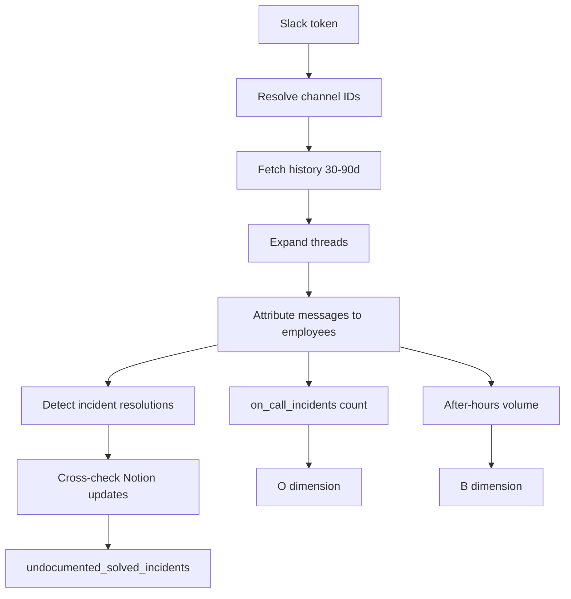

# Step 07 — Slack Telemetry

**Depends on:** 01  
**Blocks:** 03 (live D, O, B signals)  
**Estimate:** 5–7 days  
**Reference:** WorkFera escalation shadow patterns

## Escalation / shadow routing (WorkFera)

Detect structural concentration via Slack:

```
IF employee @mentioned in >= 8 incident threads (90d)
AND >= 70% of #incidents threads for a component mention same person
THEN S dimension signal + evidence
```

Evidence: “Last 8 `#incidents` threads escalated to {name}”

Feeds **S — Structural** dimension (Step 02), not surveillance metrics.

## Goal

Ingest Slack workspace data for incident participation, on-call exposure, and tacit knowledge signals — especially undocumented incident resolutions.

## Current state

- `fetch_slack_users_live` in `employee_master_fetch.py`
- Integration catalog describes sync intent; no ERA telemetry yet
- Investigation module has mock Slack references

## Data to pull

| Data | Slack API | ERA use |
|------|-----------|---------|
| `users.list` | Identity, manager fields | Step 01 (directory) |
| Channel list (configured IDs) | `conversations.list` | Scope |
| Channel members | `conversations.members` | On-call channel membership |
| Message history (incident channels) | `conversations.history` | D, O |
| Thread replies | `conversations.replies` | Incident resolution attribution |
| User message counts | Derived | B, communication bottleneck |

## Configuration

From `IntegrationConfig.slack`:

```typescript
{
  workspaceUrl: string;
  botToken: string;
  channelIds: string;        // comma-separated
  incidentChannelIds?: string;  // optional override
  onCallChannelIds?: string;
}
```

**Required scopes:** `users:read`, `users:read.email`, `channels:history`, `channels:read`, `groups:history` (private channels if needed)

## Pipeline



## Incident resolution heuristic

A thread counts as **resolved incident** when:

1. Channel is in `incidentChannelIds` OR message contains `#incident` / severity keywords
2. Thread has ≥3 messages from ≥2 users
3. Last message from employee E contains resolution patterns (`resolved`, `fixed`, `root cause`, `mitigated`) OR is accepted via reaction ✅

## Undocumented resolution

```
IF incident_resolved_by(E) in last 90d
AND no Notion runbook edit within 7d after thread end for linked component
THEN undocumented_solved_incidents += 1
```

## On-call incidents

Count threads in `onCallChannelIds` where E posted ≥2 messages in a 4-hour window.

## Communication bottleneck

```
IF E posts > 40% of messages in >= 3 critical channels
THEN structural signal (optional S sub-factor)
```

## Edge cases

| Case | Handling |
|------|----------|
| Message retention (90d limit on free) | Document lookback window in `sync_freshness` |
| Private channels bot not in | Skip with warning in integration health |
| Bot messages | Exclude from attribution |
| `@channel` posts | Don't count as individual expertise |
| Deleted users | Map via email snapshot at sync time |
| GDPR / EU workspace | Respect data policies; aggregate counts only in ERA |
| Rate limits (Tier 2) | Paginate cursor; backoff |
| Thread parent not in history | Fetch replies only if parent known |
| Cross-workspace | One token per workspace |
| Incident channel misconfigured | Empty signals + warning |

## Privacy framing (UI copy)

- Show **counts and thread titles**, not message bodies, on ERA dashboard by default
- Full thread link opens Slack (user must have access)
- Avoid surveillance metrics (total messages/day) in main ERA score

## Evidence items

| Condition | Title |
|-----------|-------|
| undocumented incident | "Resolved incident in #{channel} without runbook update" |
| sole responder | "Only responder in {n} incident threads for {component}" |
| on-call load | "{n} on-call incidents in 30 days" |
| after-hours | "High after-hours Slack activity in on-call channels" |

## Testing

- Fixture channel history JSON
- Resolution thread without Notion edit → undocumented count
- Bot-only thread → no attribution

## Exit criteria

- [ ] `process_external_app_sync("slack")` implemented
- [ ] D dimension uses real undocumented count when Slack+Notion connected
- [ ] Evidence links to Slack thread URLs (`https://workspace.slack.com/archives/...`)

## Files to touch

- `backend/app/services/slack_client.py` — new
- `backend/app/services/integration_sync.py`
- `backend/app/services/integration_telemetry.py` — slack snapshot
- `backend/app/routes/integrations.py`
