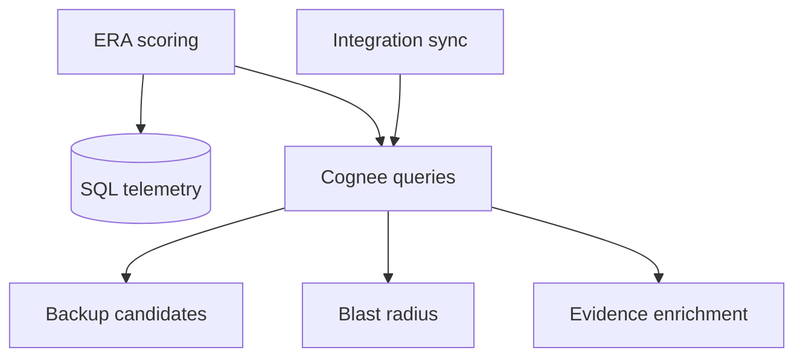

# Step 10 — Cognee Intelligence

**Depends on:** 03, 06 (Notion edges), **15** (review-weighted backups)  
**Estimate:** 5–7 days

## Backup candidate ranking (ContributorIQ)

```python
backup_score = (
    doa_secondary_pct * 0.4
    + review_participation * 0.35   # Step 15
    + recent_commits * 0.25
)
label = "ramping" if review_participation >= 3 else "secondary"
```

## Goal

Use Cognee graph for multi-hop queries: backup candidates, documentation gaps, blast-radius narratives, and evidence enrichment beyond SQL telemetry.

## Queries to implement

### 10.1 Backup candidates

```
Employee E → ownsComponent → Component C
Component C ← contributedTo ← OtherEmployee O
Filter: O != E, active, ordered by ownership_pct + review_count
```

Return top 3 per owned SPOF component.

```python
async def find_backup_candidates(
    tenant_id: UUID,
    employee_id: str,
    component_id: str,
    limit: int = 3,
) -> list[BackupCandidate]:
```

### 10.2 Documentation gap (graph)

```
Component C → documentedBy → NotionPage P
IF no P exists OR P.last_edited stale → gap edge missing
```

Cross-check with Step 06 SQL signals; graph used for evidence narrative generation.

### 10.3 Blast radius narrative

For employee detail hero subtitle, optional Cognee `search`:

```
"What systems depend on {employee_name}'s owned components?"
```

Feed into `recovery_estimate_weeks` refinement.

### 10.4 Evidence enrichment

When building evidence items, append related graph nodes:

- PR → modifies → Component → blocksComponent ← JiraTicket

## Cognee ingest additions

### Notion `documentedBy` edge

```python
Edge(
    source=component_node,
    target=notion_page_node,
    relationship="documentedBy",
)
```

### Slack incident summary nodes (optional)

```python
class GraphSlackIncident(DataPoint):
    thread_id: str
    channel: str
    resolved_by: GraphEmployee
    resolved_at: str
    component: GraphComponent | None
```

## Architecture



## Performance

| Rule | Detail |
|------|--------|
| ERA list endpoint | No Cognee calls — SQL only |
| Employee detail | Cognee on demand, cache 1h |
| Backup candidates | Precompute on sync for SPOF components |

## Degradation

```python
try:
    candidates = await find_backup_candidates(...)
except CogneeUnavailable:
  candidates = []  # SQL fallback: secondary GitHub owners only
  warnings.append("cognee_degraded")
```

## Edge cases

| Case | Handling |
|------|----------|
| Cognee empty graph | Fallback to GitHub ownership only |
| Cognify lag | Serve stale graph + warning |
| Multi-tenant dataset | `tenant_dataset_name(tenant_id)` |
| Circular graph paths | Limit traversal depth 3 |
| No backup exists | Empty list + high K evidence |
| LLM hallucination in search | Never use free-text search for scores; only structured edges |

## Testing

- [ ] Fixture graph with 2 contributors → backup ranked correctly
- [ ] Missing documentedBy → gap detected
- [ ] Cognee down → API still 200 with warning

## Exit criteria

- [ ] Backup candidates on employee detail API
- [ ] `documentedBy` edges from Notion sync
- [ ] Evidence items include graph-derived Jira links where applicable

## Files to touch

- `backend/app/services/cognee_era_intelligence.py` — new
- `backend/app/services/cognee_ingest.py`
- `backend/app/services/integration_sync.py` — notion, slack graph nodes
- `backend/app/routes/analytics.py` — detail endpoint
