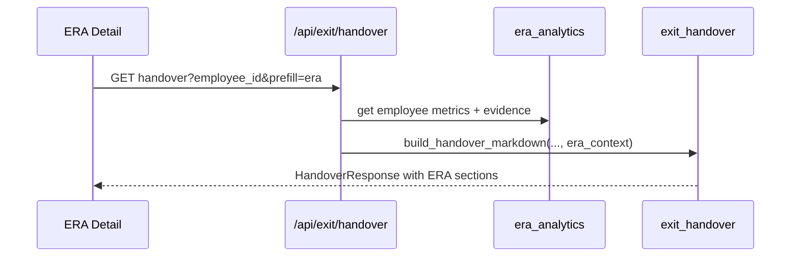

# Step 16 — ERA → Exit Handover Bridge

**Depends on:** 03, 09, 12  
**Estimate:** 3–5 days  
**Reference:** [WorkFera — Employee exit knowledge transfer](https://www.workfera.com/solutions/employee-exit-knowledge-transfer)

## Goal

Wire ERA evidence into the existing **Exit** module (`/exit`, `build_handover_markdown`) so high-risk employees get structured handover packs without re-entering data.

## Current state

- `GET /api/exit/handover?id={employee_id}` → markdown handover
- `exit_handover.py` uses synthetic undocumented counts today

## Flow



## Handover sections (ERA-enriched)

| Section | Source |
|---------|--------|
| Critical knowledge to transfer | Top 10 evidence by `impact_points` |
| Owned components & SPOF flags | `affected_components` |
| Suggested successor | Step 10 backup candidates #1 |
| Open mitigations | Step 12 `mitigation_status=open` |
| Tacit knowledge gaps | D dimension — undocumented incidents |
| Hotspot files | Step 13 critical quadrant files |
| Jira / ops backlog | O dimension counts + links |

## API changes

```
GET /api/exit/handover?id={employee_id}&prefill=era=true
```

```python
class HandoverResponse:
    # existing
    markdown: str
    filename: str
    # new optional
    era_risk_score: float | None
    era_sections_included: list[str]
```

## UI

- **ERA detail drawer:** button “Start exit handover” → `/exit?employee={id}&prefill=era`
- **Exit page:** banner when opened from ERA — “Pre-filled from ERA risk assessment”

## Edge cases

| Case | Handling |
|------|----------|
| ERA data stale | Show `computed_at` in handover header |
| `demo_mode` | Warn in handover preamble |
| Leadership employee | ERA excluded — handover still works without ERA sections |
| No evidence | Generic handover template |

## Exit criteria

- [ ] Handover markdown includes ERA evidence sections when `prefill=era`
- [ ] One-click navigation from ERA detail to Exit
- [ ] Open mitigations copied as checklist in markdown

## Files to touch

- `backend/app/services/exit_handover.py`
- `backend/app/routes/exit.py`
- `backend/app/schemas/exit.py`
- `frontend/src/components/era/EraDetailDrawer.tsx`
- `frontend/src/components/exit/ExitHandoverView.tsx`
